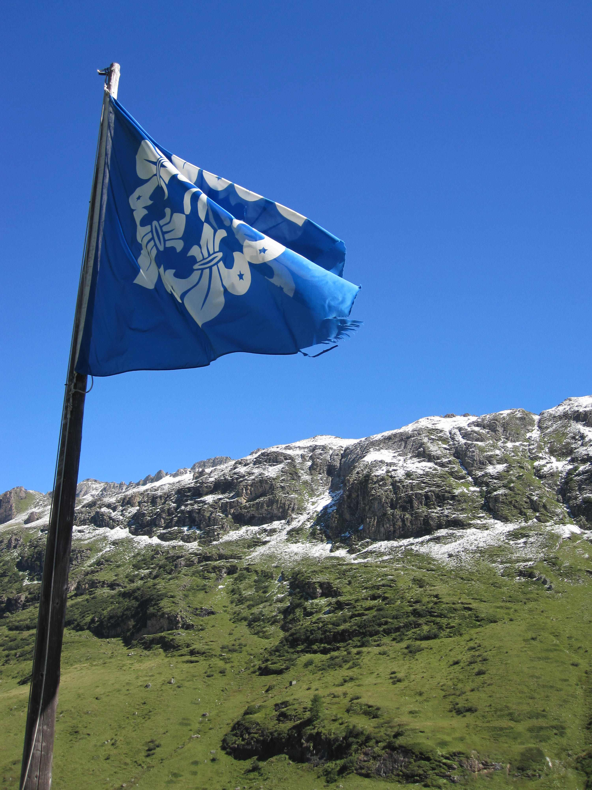
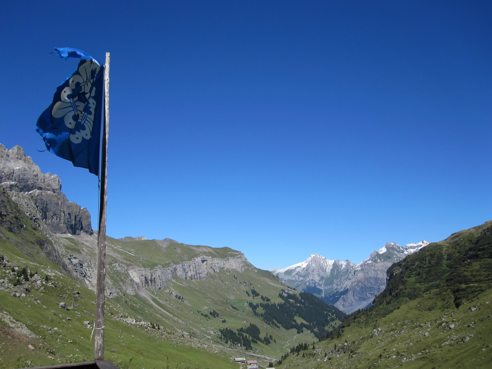
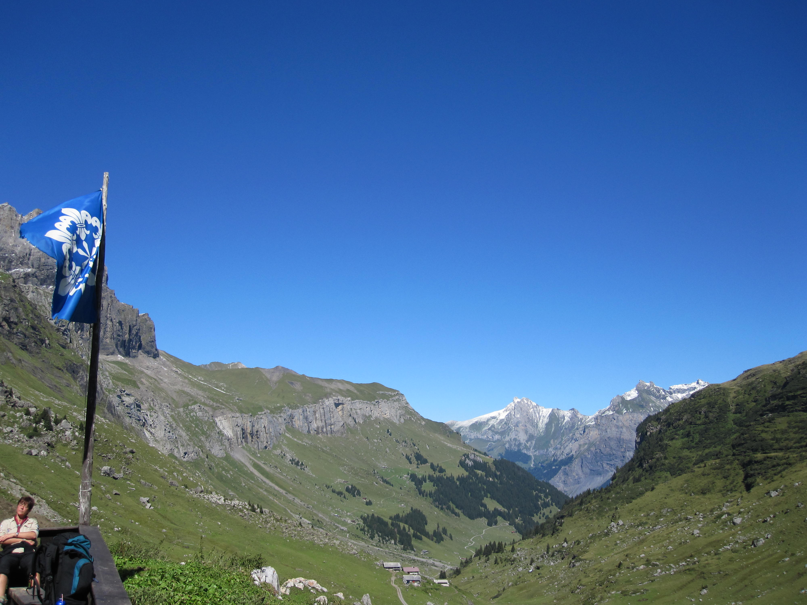
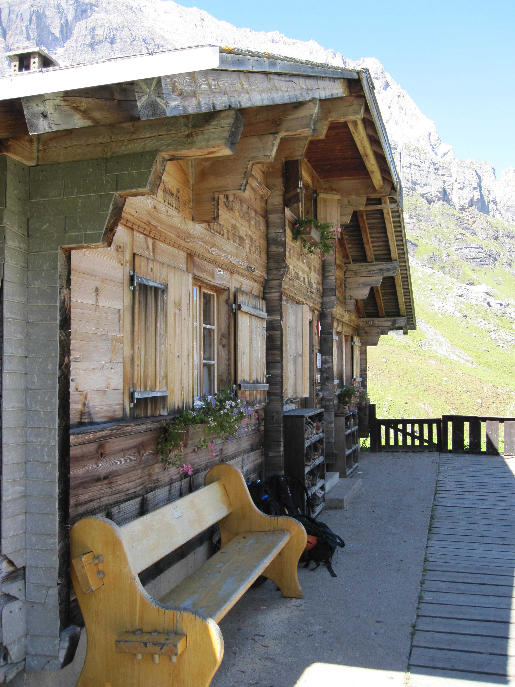
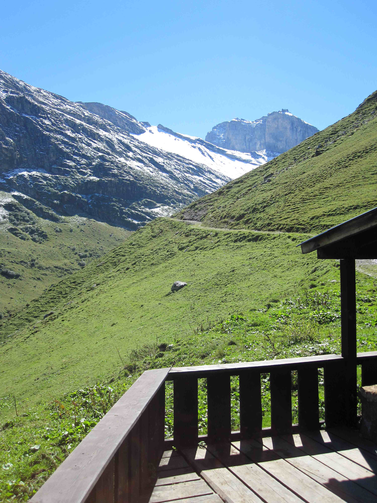
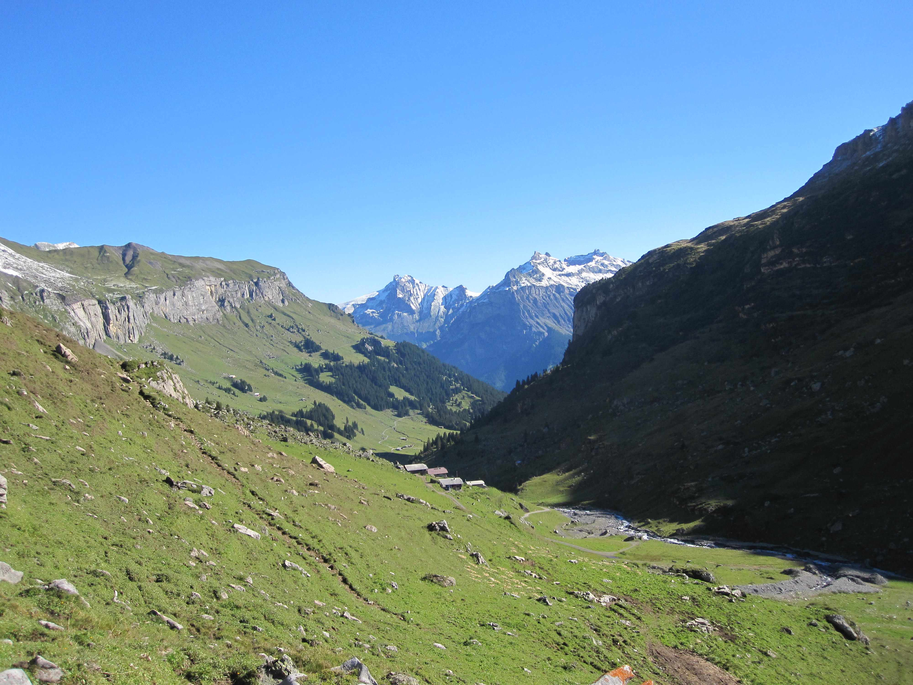
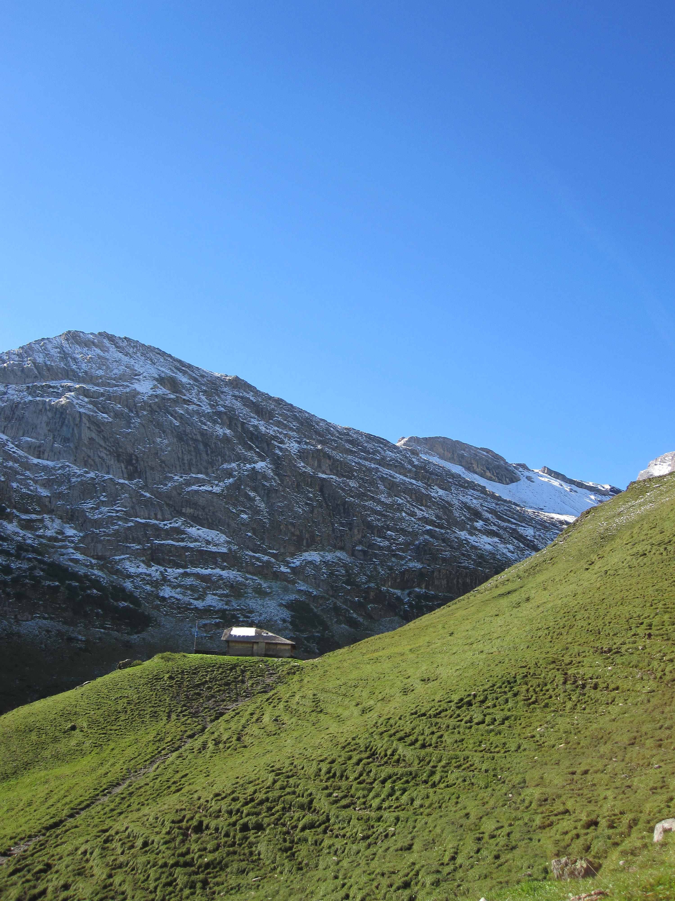
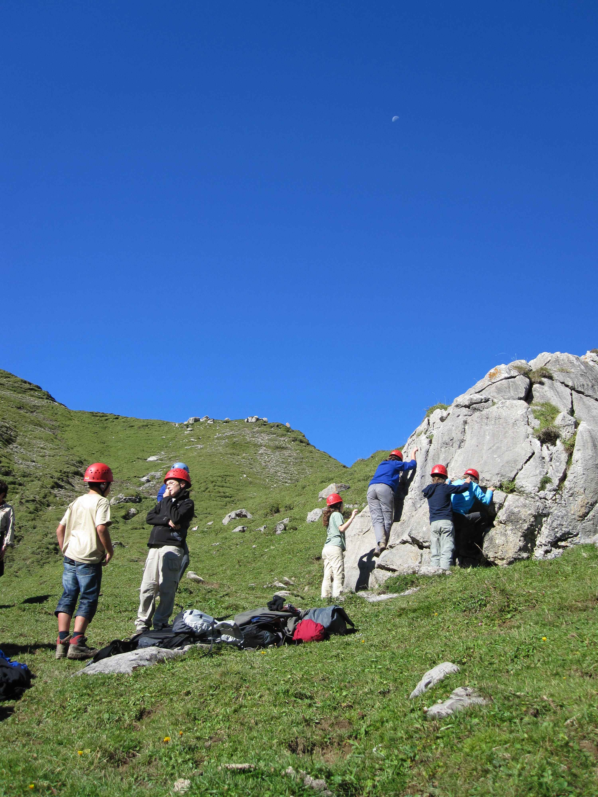
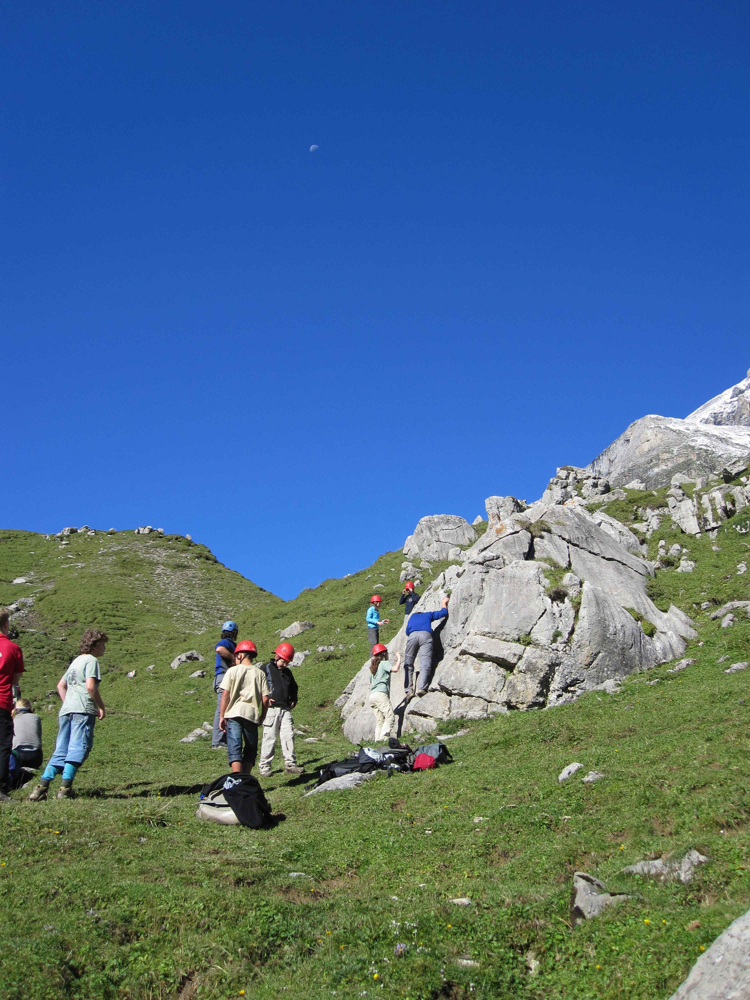

_Cross-posted from [kandersteg.posterous.com](http://kandersteg.posterous.com)_

Here's the last couple photos that I've got from the summer.

This is from my [Overnight Climbing Workshop](http://www.kisc.ch/index.php?uid=44&amp;cmd[incms][content][fullview][main][uid]=2219&amp;cmd[incms][content][fullview][main][cmd][itemid]=36) that I ran in the last couple of weeks with Joe (UK). We (climbing is always run with two people so we can have two ropes) had a German group who didn't speak much English, but we had some fun anyway. We hiked up to the [Upper Hut](http://maps.google.com/maps?f=q&amp;source=s_q&amp;hl=en&amp;geocode=&amp;q=46.454534,7.621797&amp;sll=46.454638,7.621915&amp;sspn=0.008086,0.021136&amp;ie=UTF8&amp;ll=46.454534,7.621765&amp;spn=0.06469,0.169086&amp;z=13) - the mountain hut that the Centre owns at 1890m - in the afternoon, stayed overnight in the freezing cold (there was snow on the roof when we got there). The hut is only heated by a small wood fire and warmed up by cutting wood to make it fit. Then in the morning (as you can see it was glorious) we went out for some [bouldering](http://en.wikipedia.org/wiki/Bouldering) on nearby rocks, had some lunch back at the hut, and did some climbing (with ropes) and hiked home. I was a great 2 days of firsts for me - first 'real' time in the hut, and first outdoor climbing of the season (even though I didn't really get to climb properly).

This season was the best thing I've ever done, and I loved every second of it, it's hard to put it into words. The place, the views, the job, and most of all the friends I made ~~were~~ are incredibly amazing, and I hope that I'll see everyone again at some point. I wanted to say thank you to everyone for being awesome. I'm going back for 2 weeks in the winter, and I'll probably apply to go back next summer as well, and I can't wait. Especially as Salla (FI), Sara (IT), Emmy (SE) and Pete (UK) are going back this winter - it's going to be awesome seeing them again and hopefully seeing some more people next summer. I'd definitely recommend going there as a guest or as [staff](http://www.kisc.ch/staff/short-term-staff/) to anyone.

C'ya in December! (I'll post some pictures up here then).
