*Cross posted from my [Kandersteg blog](http://kandersteg.posterous.com). For all of my photos, check it out. Ed.'s note: Posterous shut down on 30th April 2013, so this blog was discontinued. I may try to revive it sometime, when I'm finished tidying up this site.*

So that's it for another summer, I'm back at home getting bored and wishing I was still in Kandersteg. I loved every moment of it, from working on the glacier to meeting a whole bunch of new friends. I've picked out some of my favourite photos from the whole season

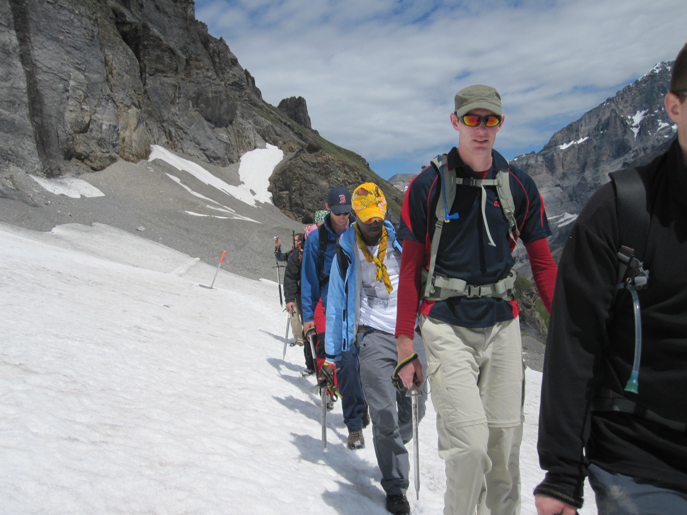

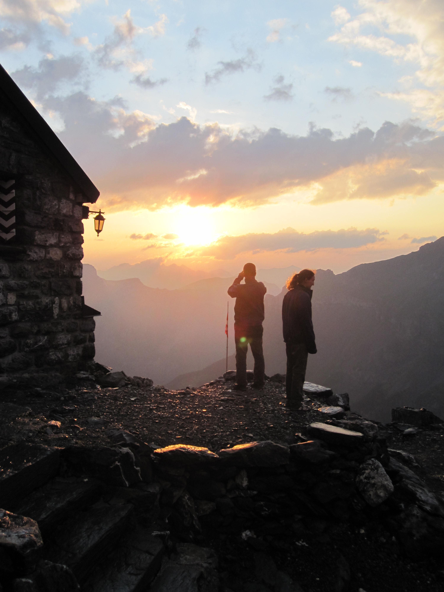

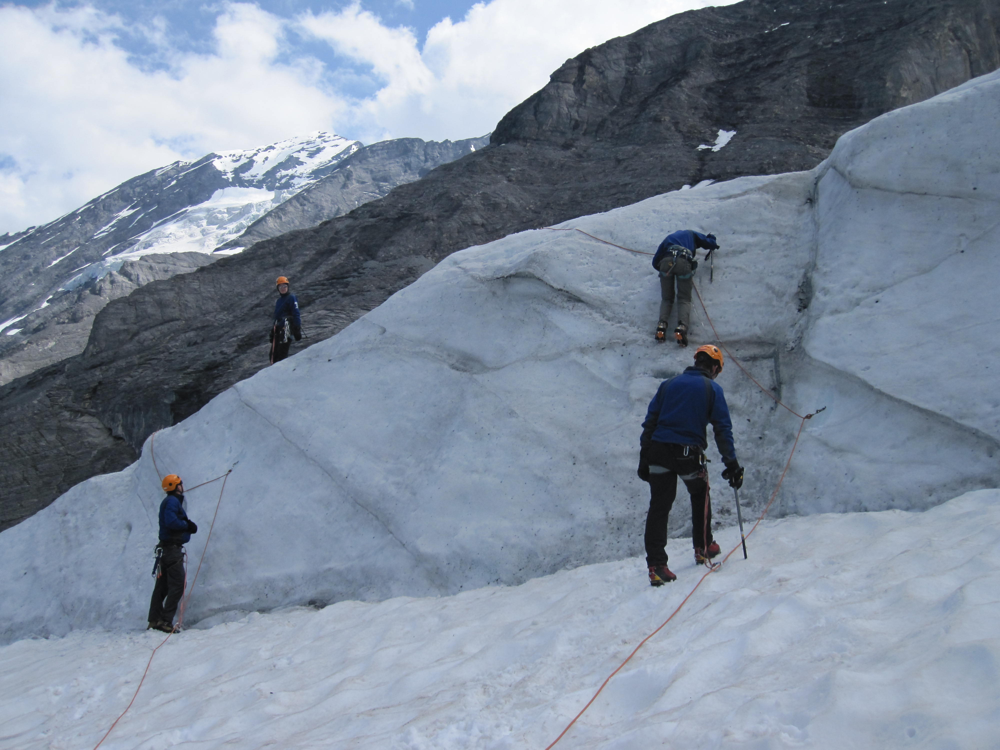

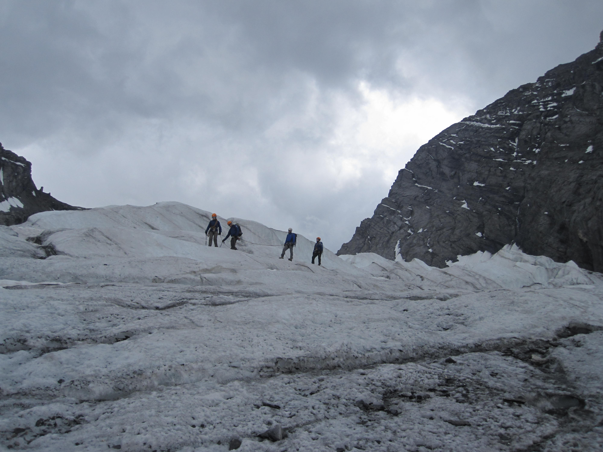

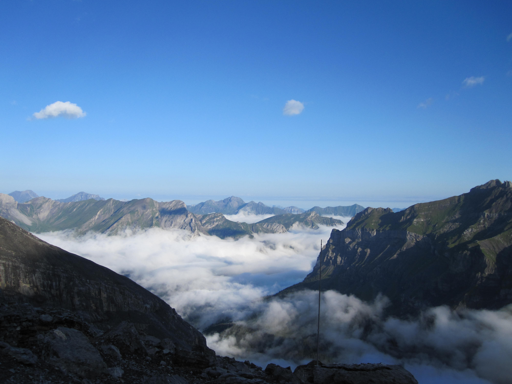

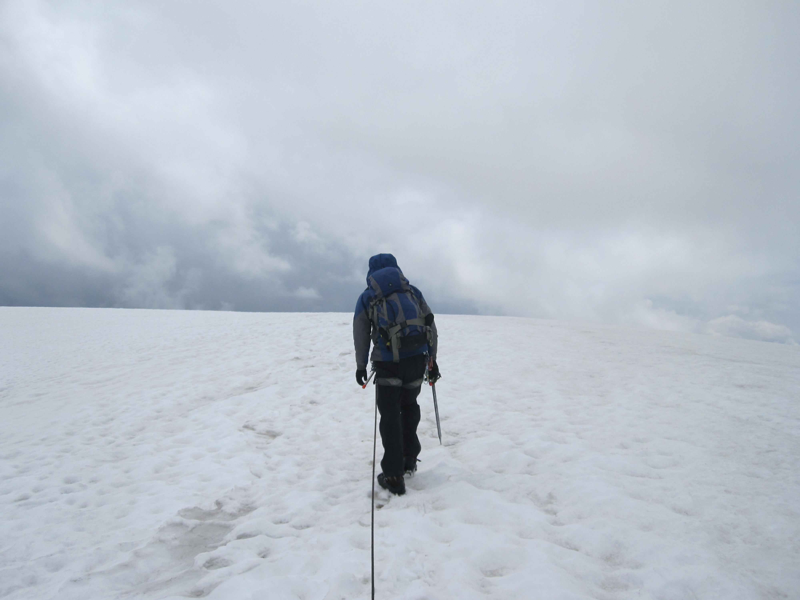

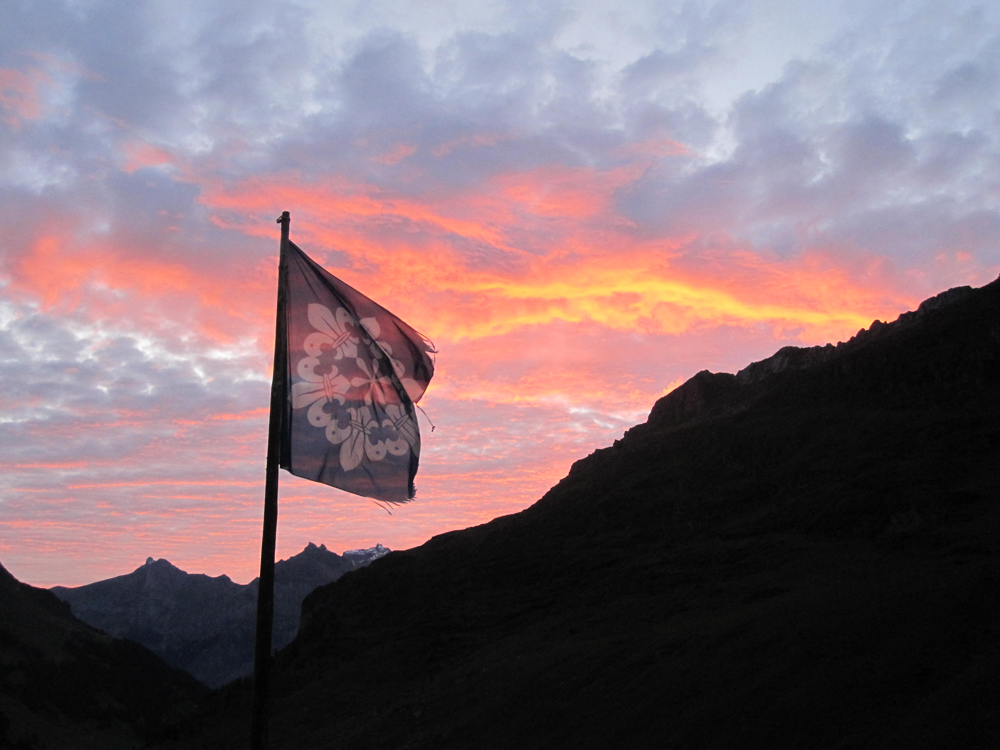

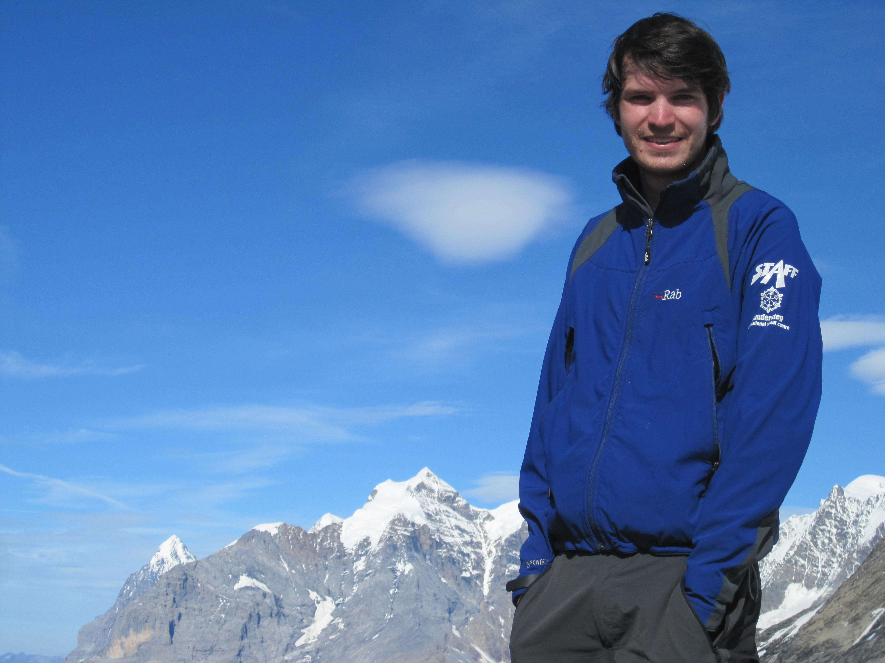

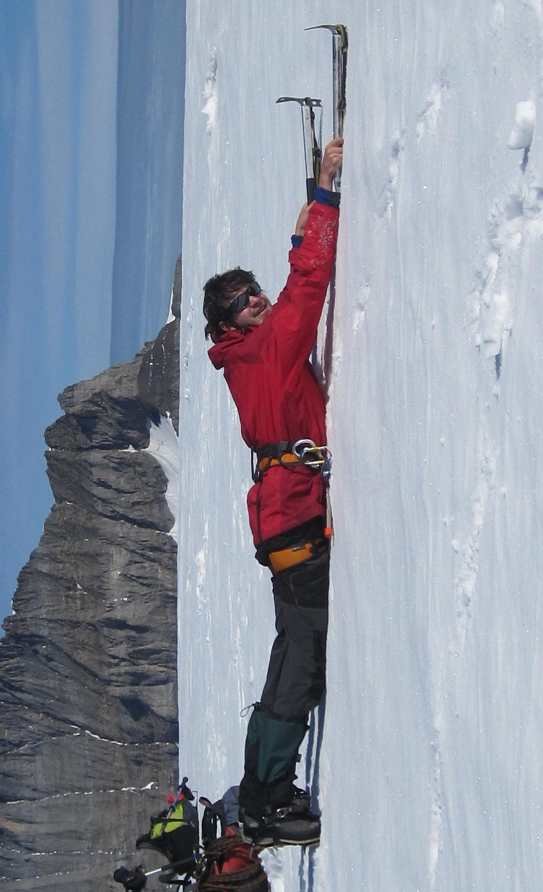

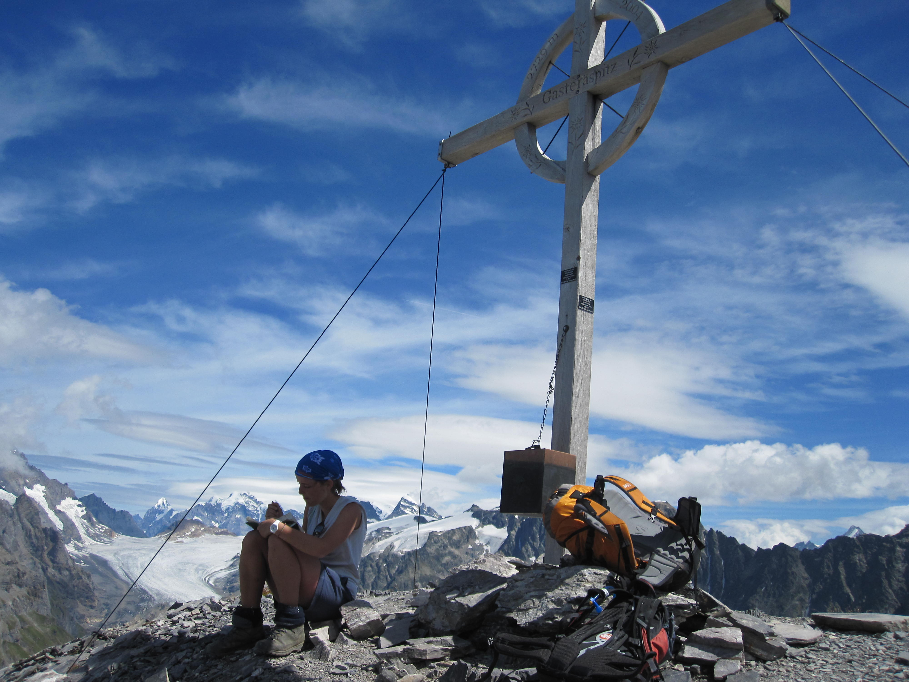

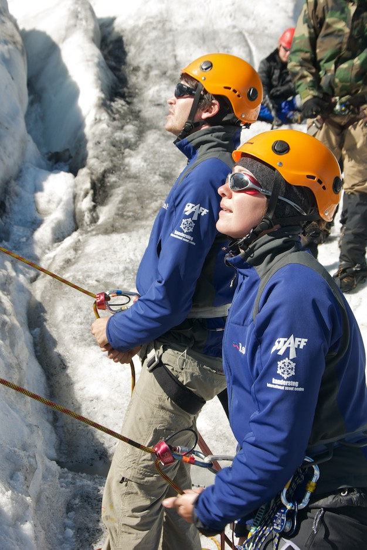

I'm super lucky to have got the opportunity to have done some really fun and rewarding jobs while in this amazing place - working with groups who've never even seen a glacier, getting up to the Frundenjoch, [hiking](http://kandersteg.posterous.com/gasternspitz") and climbing on my days off, getting a chance to show the other staff how awesome [SnICE](http://kandersteg.posterous.com/snice-training) is, my group [1st Finch visiting](http://kandersteg.posterous.com/1st-finch-at-kisc) and generally just hanging out with some really cool people.

I don't want to sound like an Oscar winner, but a few thanks are in order - firstly to Tom and Matt for giving the job in the first place! To Jemma, Kim and Mick for being the best SnICE team ever, and finally to all the rest of the Summer 2011 Staff for simply being awesome - I'm gonna miss you guys :)

I've got everything crossed hoping that they'll need my help in the winter, for the ski weeks because I loved that so much last winter. And after that, I'm not going back next summer (probably) but I'll be back sometime in the future....

Thanks once again KISC, you've been amazing.
