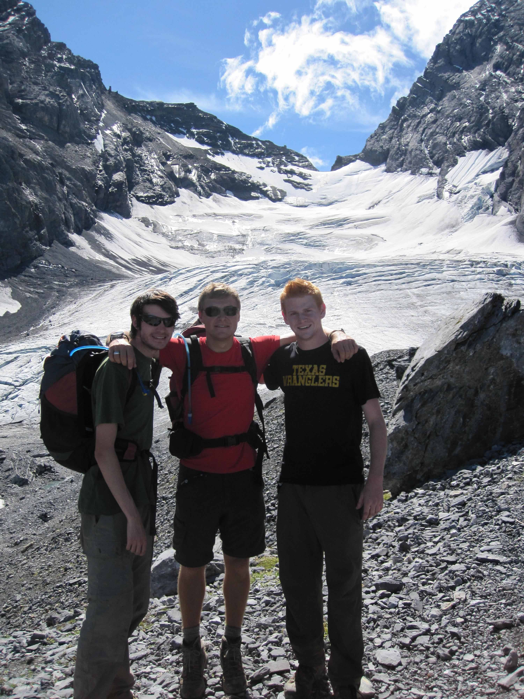
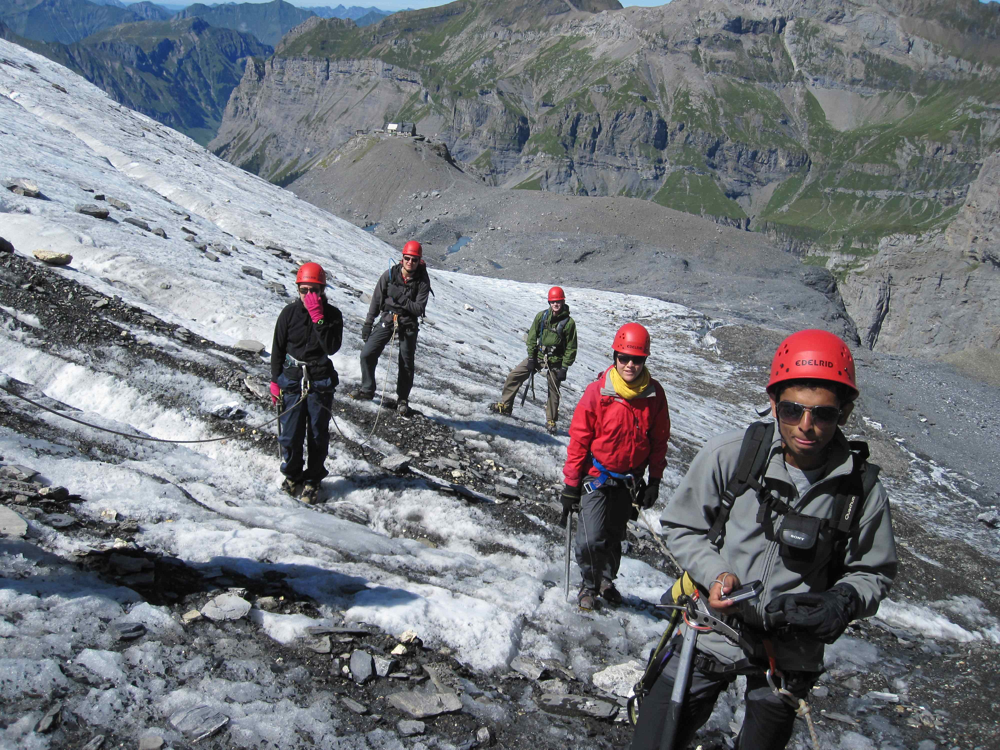
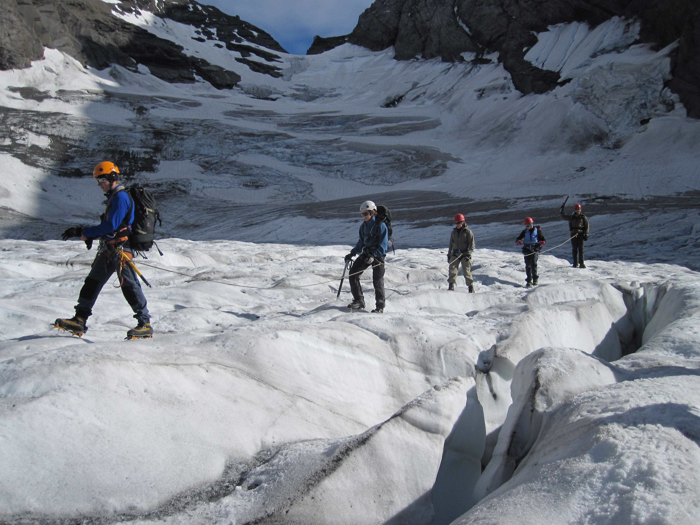
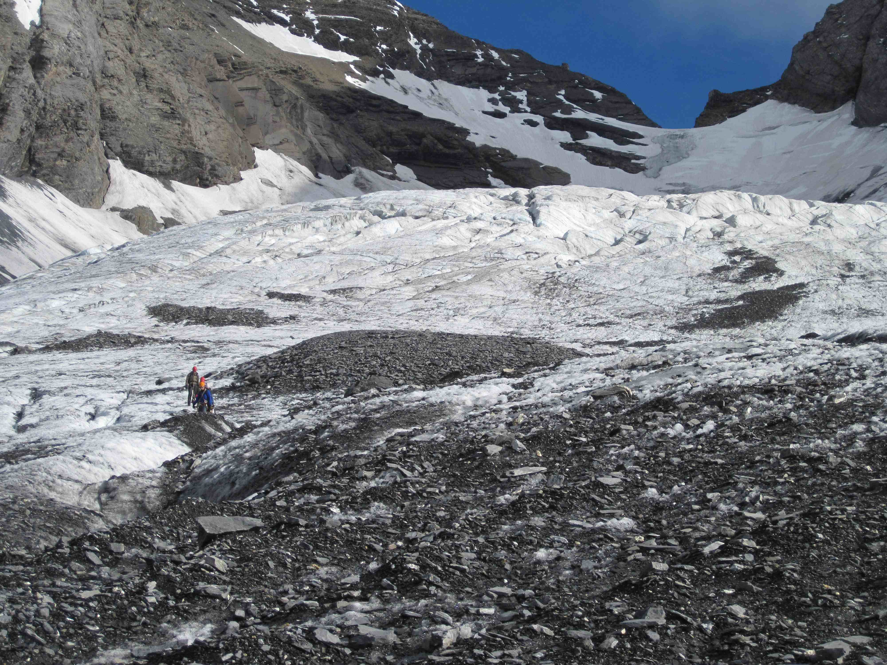
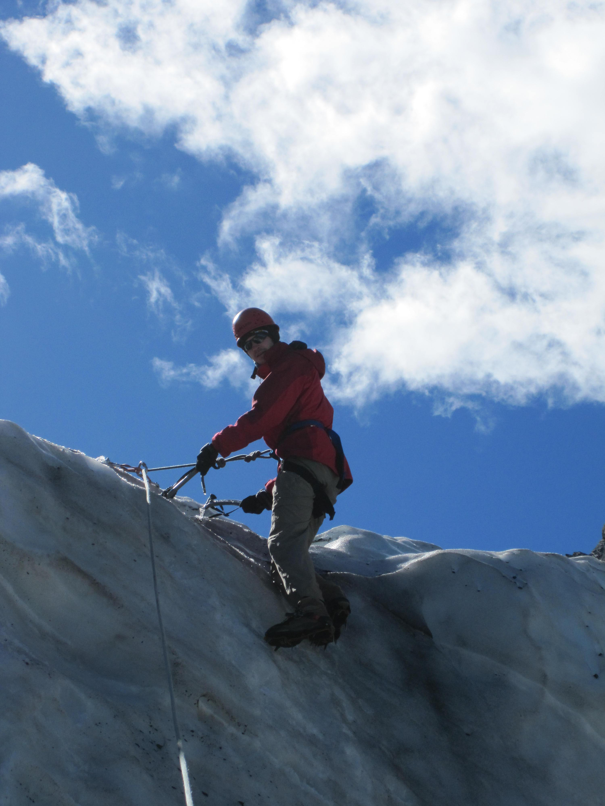

*Cross-posted from my [Kandersteg blog](http://kandersteg.posterous.com). Ed.'s note: Posterous shut down on 30th April 2013, so this blog was discontinued. I may try to revive it sometime, when I'm finished tidying up this site.*

I'm super excited to say that in just under a week, I'll be back at [KISC](http://www.kisc.ch) :)

I'm gonna be working as a Snow & Ice (SNICE) Guide, which means that I'll be taking groups up onto a couple of glaciers to get geared up with crampons, ice axes and ropes. We'll be teaching some basic glacier techniques - jumping over crevasses, [ice axe self-arrest](https://www.youtube.com/watch?v=YyRF6AjAI94), crevasse rescue - some ice climbing and trekking. I [tried it out last summer](http://kandersteg.posterous.com/frunden-glacier-expedition) and I've picked a few of the best photos:

I absolutely loved trying it last year, and can't wait to do some of the expeditions I didn't get a chance to do. I'll be staying overnight in mountain huts a lot, which is great, and I'll be working more with other staff which will be awesome!

I really can't wait to get out there especially as a whole bunch of my friends from last summer have also got jobs, and I'll get to see them for a whole 2 months :D Plus, my scout group is coming to stay for 2 weeks, so I'm getting a few days off to help out with their programme.

As I did last summer (and in the winter), I'll be posting photos here and writing up what I've been doing - hopefully I'll do that more this time! But I won't be online as much as I am now - my tweeting will definitely drop off (relief to some!) - hopefully I'll pick up on @replies and emails.

7 days and counting...
