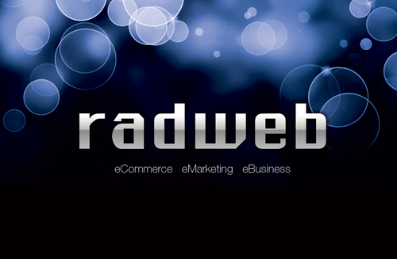

_I haven't blogged in a while, which seems to be the way I start every post here..._

If you've visited my nameplate ([alasdairsmith.org.uk](http://alasdairsmith.org.uk)) site in the last few months you might have seen a big banner at the top, shamelessly promoting myself :) I'm really pleased to announce that I can now take it down! For the next year, I'm officially part of the small but growing team at [Radweb](http://www.radweb.co.uk). We (feels weird to write that) create awesome stuff for the web, from WordPress and Magento sites to full blown, built from the ground up, web apps.

I'm going to mainly be working on [InventoryBase](http://inventorybase.com), a brand new web app that is designed to help landlords keep track of their inventories. We just released a promo video, with an insanely catchy tune that's been playing all week in the office:

<iframe src="https://www.youtube.com/embed/g2hpyVfo394?wmode=transparent" allowfullscreen frameborder="0" height="417" width="750"></iframe>

InventoryBase is built on BackboneJS, with a backend built from FuelPHP. This is a pretty big step up in level of coding complexity for me, and I'm really excited to dive in some more. At the moment it looks like I'll be full time on this project at least until September, to help bring it fully up to it's potential.

In addition, I'm going to open-source my big coursework project that I've been working on for the last couple of months. Check the [blog post](http://40thiev.es/wikivle-open-sourced), or view the [source code](https://github.com/40thieves/WikiVLE).

PS. Try the super-secret cheat code on [inventorybase.com](http://inventorybase.com) - press up, up, down, down, left, right, left, right, B, A on your keyboard to see what I mean.
