Me and my dad have been watching F1 for about as long as I can remember. We've been to Goodwood's Festival of Speed event a couple of times before, and it's a great chance to get right up to the cars. It's pretty damn rare these days in F1.

So anyway, we had a look around the paddock, watched some of the runs up the hill and got up to see the rally stage at the top. Here's some of the pictures:

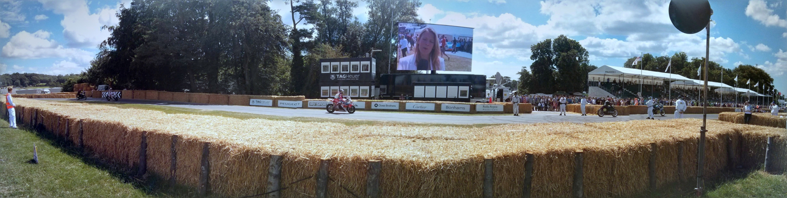

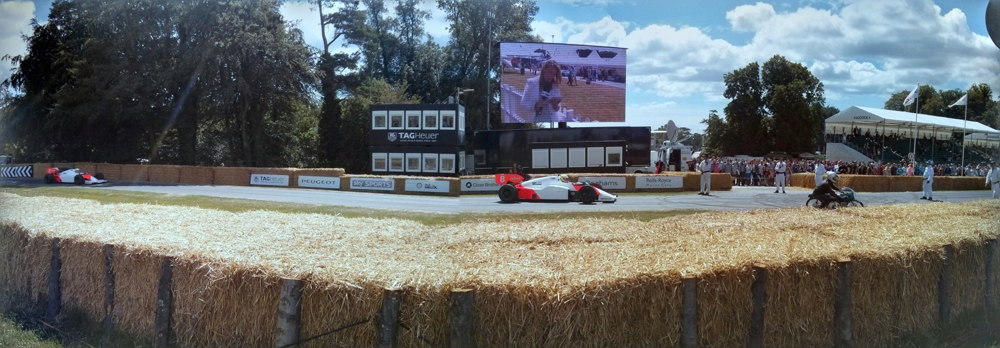

Some pretty neat panoramas created by Google+'s auto-awesome feature. (As much as you can hate on it, this stuff is pretty cool).

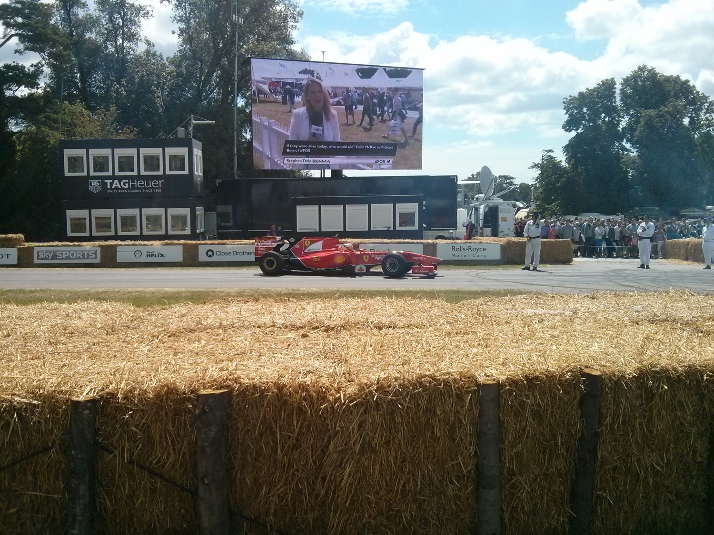

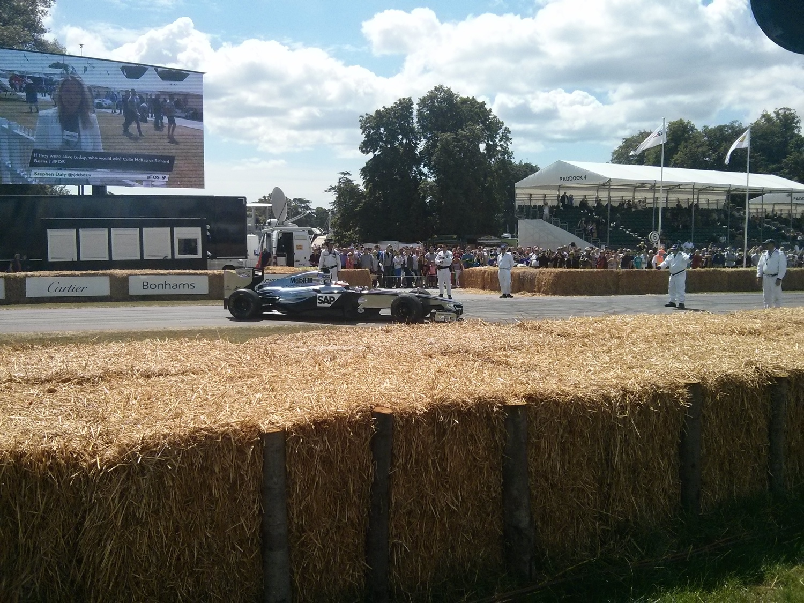

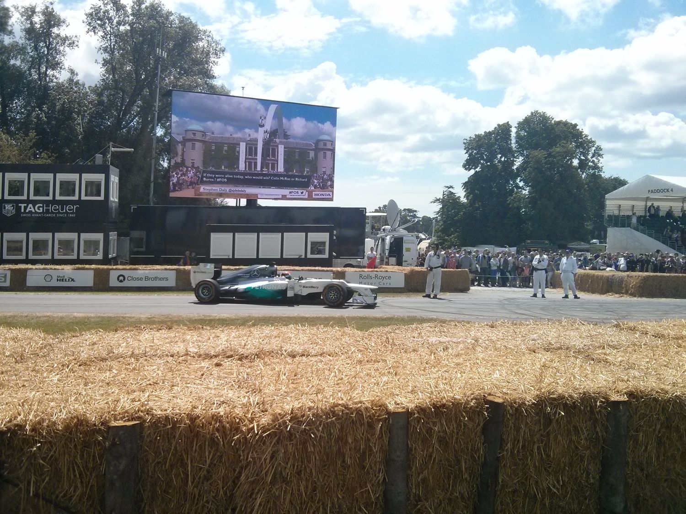

Totally got lucky with the timing here. The cars were just pulling back into the paddock after their timed run (much easier to take pictures...) and we were just in the right place at the right time.

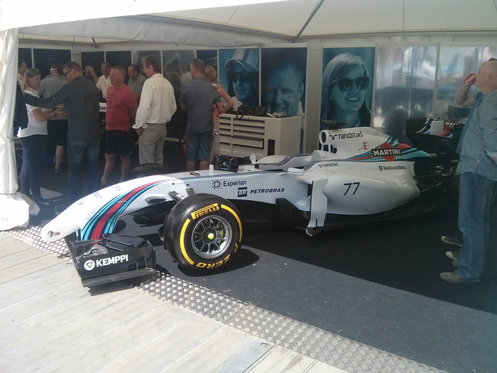

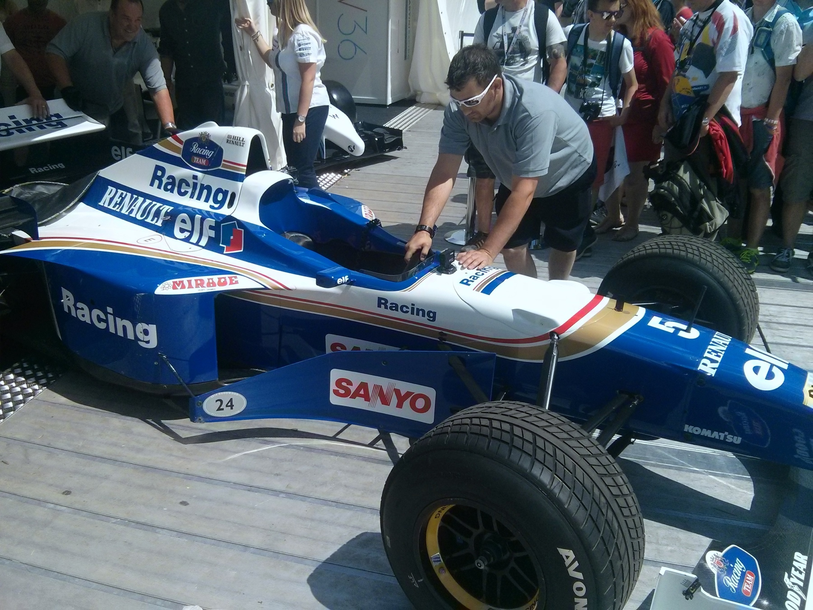

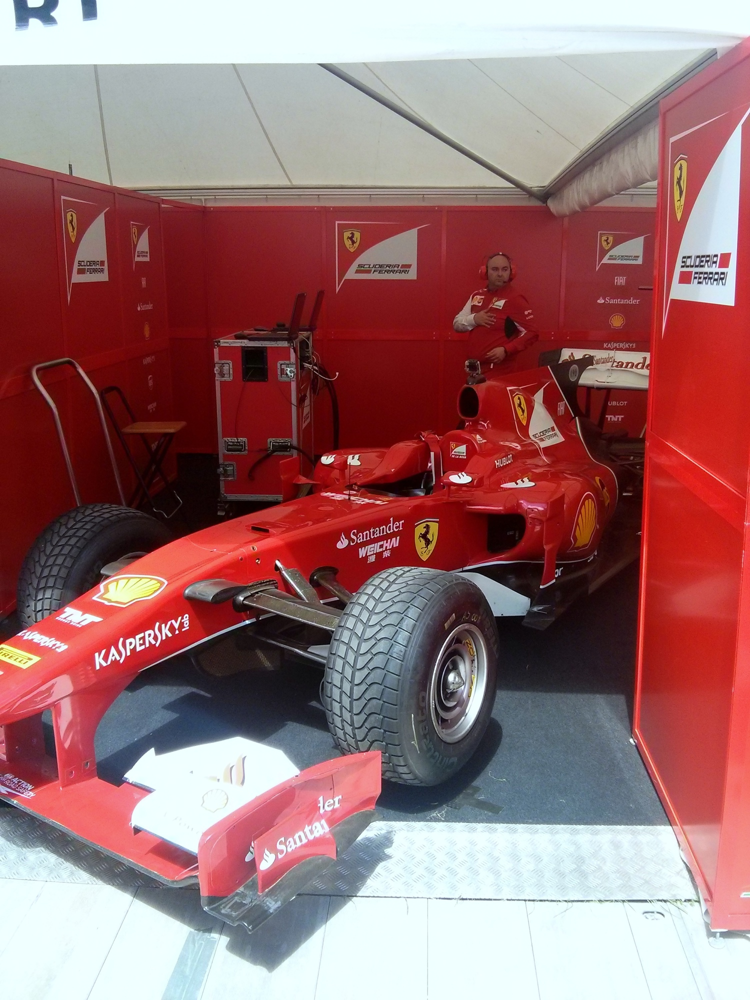

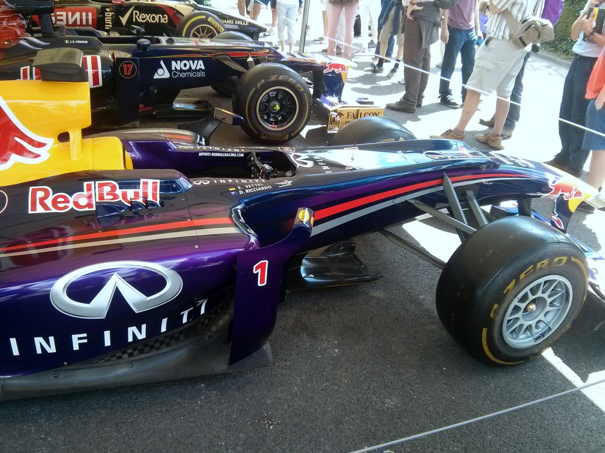

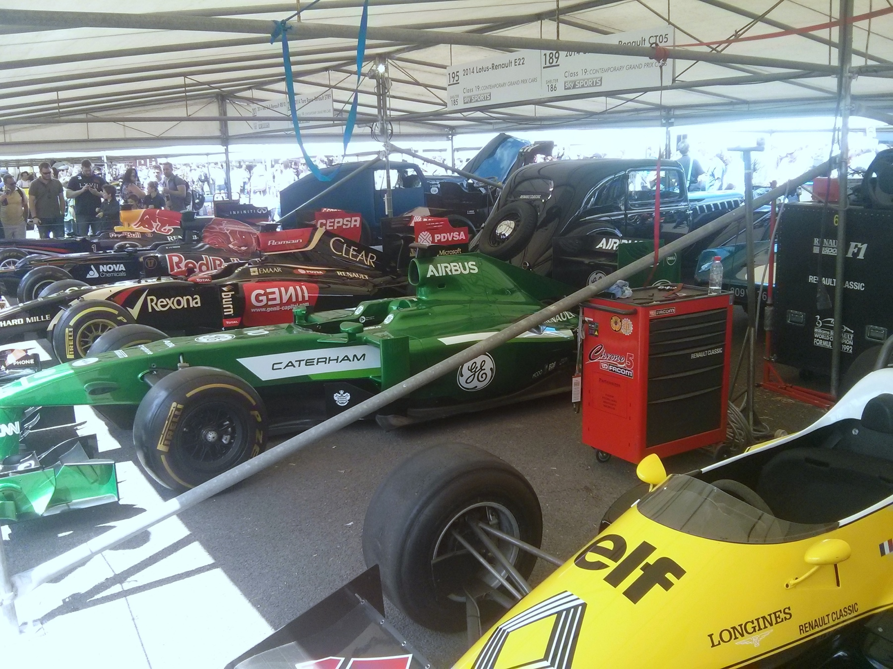

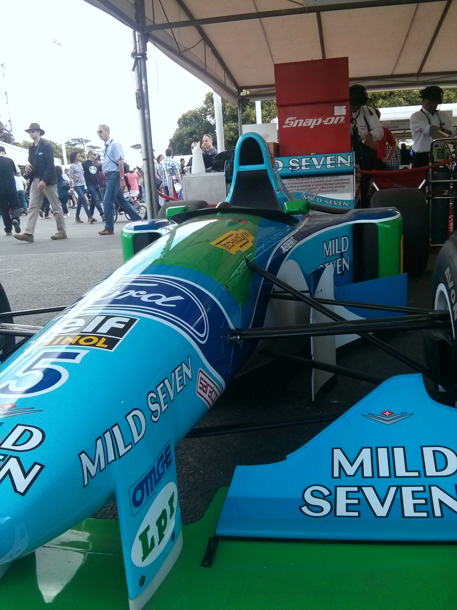

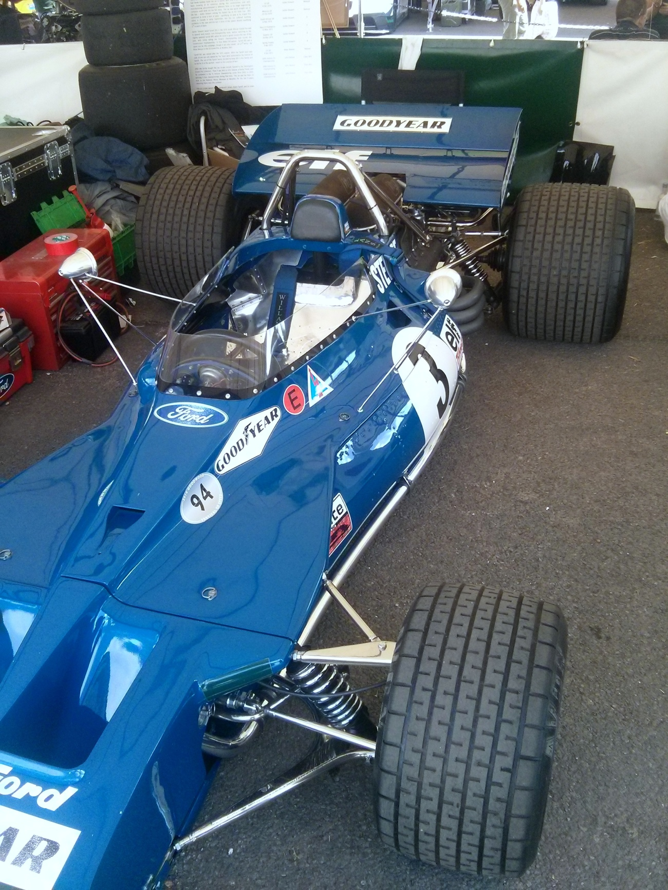

Some of the cars in the paddock. To be honest, it was a bit of a shame that there wasn't too many 2014 cars. They can't be run due to the new testing regs but I hoped they might show them off. Would been interesting to see/hear them in person.

The classic cars are always nice to see, but the Schumacher collection of 1992-1994 cars was a nice tribute. (Hoping for a speedy recovery, Michael :) )

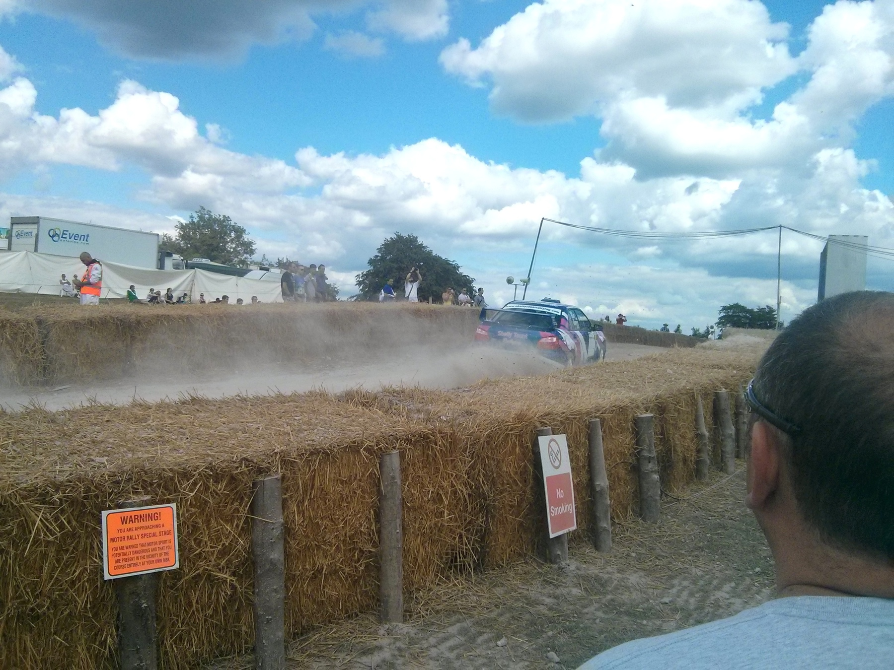

You can get really close to the rally, almost to the point of being dangerous - in most places there's only a wire and wood fence separating you from the cars... I'm not really up on rally, as I am with F1, but it's impressive to see the speed carried through the forest. Unfortunately it's a bit dark under the trees and all of my pictures were a bust. I did, however, get to see Sebastian Loeb really going for it in his new Citroen.

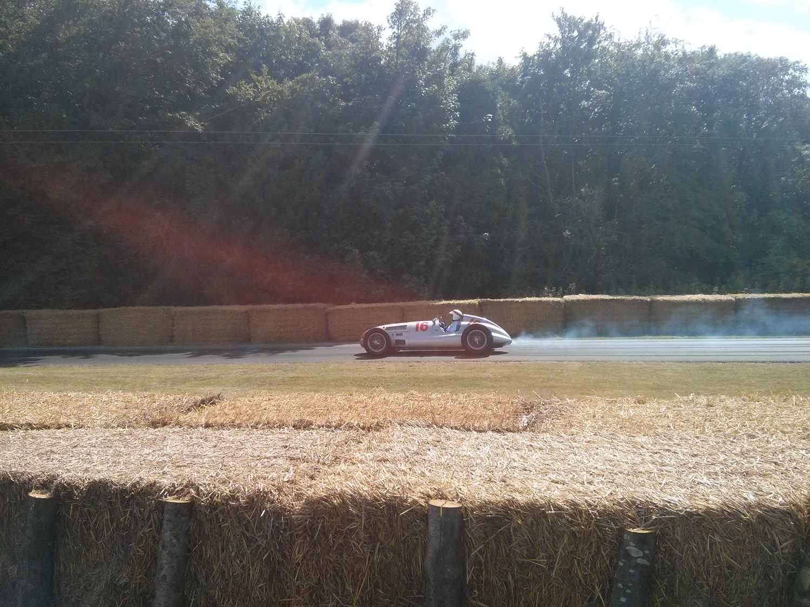

Finally, here's Jackie Stewart in his - I'm assuming it's his judging from the Stewart tartan on the seat - classic Mercedes heading back down the hill.

All in all, it was a pretty fun day out, despite the ridiculous sunburnt face I'm now sporting.
