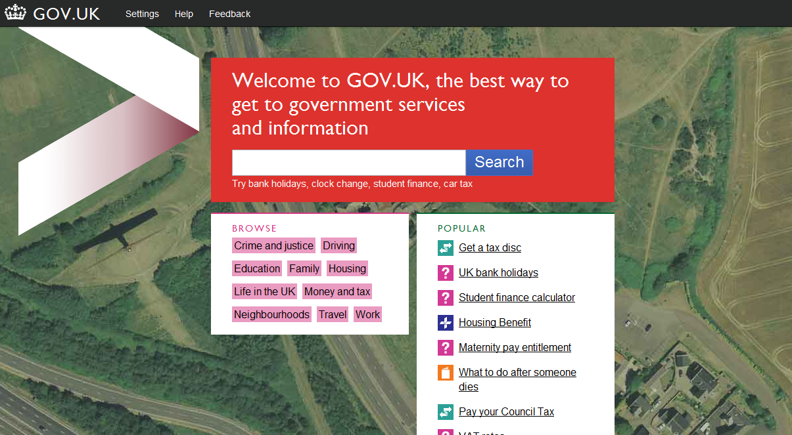

I came across this [interesting article](http://radar.oreilly.com/2012/01/with-govuk-british-government.html) on O'Reilly Radar yesterday about [gov.uk](http://gov.uk/"), the new (beta-ish) upgrade to [direct.gov.uk](http://direct.gov.uk). It's mostly about how the site was built (yay for open source), comparing with traditional government IT development.

But there's a really intriguing nugget in there - hints of an "idenity services" API. Here's the full quote:

> With regard to API's, our long term plan is to 'go wholesale,' by which we mean expose data and services via API's... We are at the early stages of mapping out key attributes, particularly around identity services, so to be fair it's early days yet."

I'm presuming by "identity services" they mean ways of programically identifying someone's online account as an actual person - somewhat similar to [OAuth](http://oauth.net). In fact, since the development is all about open source, I wouldn't be surprised if they actually built it with OAuth.

This is a really intriguing path for government to take, and I'm pretty sure that I would be controversial... I know for a fact that many (especially in the US) distrust government getting involved in the web and would hate this idea.

On the other hand, this has potential for some really great innovation in [Gov 2.0](http://radar.oreilly.com/2010/05/what-is-gov-20-come-find-out-t.html) - the concept of "Government as a platform". What if I was able to sign in to something like my bank account, or something similar with my driving license? Or my passport? This admittedly has some flaws, as there's nothing to stop the government tracking you this way. But, again, some would consider this no worse than Google or some other corporation tracking you.

I personally can't make my mind up whether I'd use something like this. What I will say is that I think that they should go right ahead and test it out, as the worse that can happen is that nobody would use it... (Actually they'd probably be torn apart for spending "X million pounds on failed IT project")

Alternatively, I could be reading __way__ too much into a single quote and they're not considering anything like an identity API.

