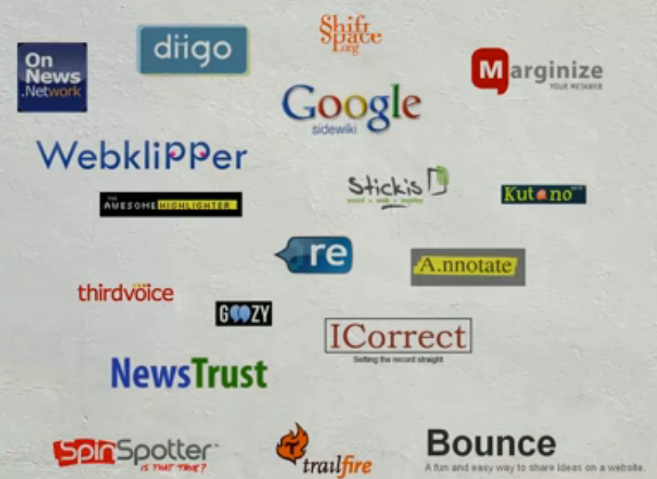

The service promises to check, verify and critique content on every web site in the world. Using a system of browser plugins, URL shorteners, a destination site and other approaches they plan to lay comments over web pages. Comments? You laugh? Well they promise to make "better quality" comments by ranking and classifying them, with sentiment analysis and a reputation system that will in effect produce community peer review.

If this works, then I agree with [Marshall Kirkpatrick](http://www.readwriteweb.com/archives/hypothesis_a_peer-review_layer_for_the_internet.php) (fantastic journalist), and I'm very excited to see more. The ability to crowdsource credible and relevant knowledge right in line with the original content would greatly improve the quality of information on the internet, which increasingly affects the world around us.

However (you knew it was coming), I'm skeptical for a few reasons:

Firstly, it seems to depend quite a lot on the sentiment analysis which they're apparently calling "stance". The [video](http://vimeo.com/29633009) says they can pick up on a whole list of sentiments, which will be used to filter/rank the comments. I've not yet seen sentiment analysis that can do this accurately, despite the masses of data we have out there - unless they have an incredible new breakthrough (which I guess is possible) then I'm not sure how they can properly rank comments.

Another technology that has been promised many times and mostly failed is reputation ranking systems, again one of the tent poles holding up Hypothes.is. I'm yet to be convinced that reputation ranking systems that cover the entirety of human knowledge are even possible. Without artificial intelligence (and even then) how is it possible to accurately rank every aspect of a person's knowledge?

Depending on mainly on these technologies (as the video suggests to me) leads me to think that the supposed moderation will dodgy at best. Of course, I could be wrong especially if some crowdsourcing of comments is involved.

Next, who gets to pronounce the supposed domain experts? People who Hypothes.is are "engaging" to seed the service with quality knowledge - who are they? And how can they possibly have experts on every topic on the internet? Do their partners (so far: the Internet Archive, and the founders of Slashdot) have a say? Aren't we supposed to be avoiding a "top down editorial bureaucracy"?

Now I must admit that many of these fears have been allayed because I've found out that Hypothes.is is a non-profit. Neutrality is one of their 12 principles, but the service would be massively less useful if I suspected a basis.

What are they going to do to get me to write a comment on Hypothes.is instead on in a tweet, or a blog, or a Google+ post? In fact, there's no mention of the fact that a lot of commenting on stories these days happens elsewhere, not in the comments section. I actually happen to quite like this current system quite a lot - I have the chance to expand my thoughts and opinions right here. I would like more ability to link directly to a paragraph though - just like [Dave Winer's blog](http://scripting.com/stories/2010/11/29/theNyTimesLeadsAgain.html#p3481).

Finally, the video brings up the problem of cold launch strategies. They address this, to an extent, in their FAQ saying that all social networks have the same problem and that they'll make the service useful from the start. What actually happens remains to be seen, as I say I hope it does work.

I'm also intrigued by the "distributed" nature: is it going to try to de-centralise comments? Can I install a version on my server? If so, I'm loving this - the ability to control my content on my server is an important data perservation point. Decentralisation is a key concept of the internet, and it's high time that comments went the same way.

One more question: The video also mentions videos - how will this work, especially with the dominance of Flash? Even YouTube (backed by the mighty Google) can't really do comments on videos properly. I'd quite like to see audio mentioned too...

I really hope they manage to answer all my questions, and if they manage to pull it off then I'm extremely excited. I really like their 12 principles, especially open source, transparent and pseudonymous - all things that are ["of the web"](http://gigaom.com/2011/03/04/newspapers-need-to-be-of-the-web-not-just-on-the-web/">).
