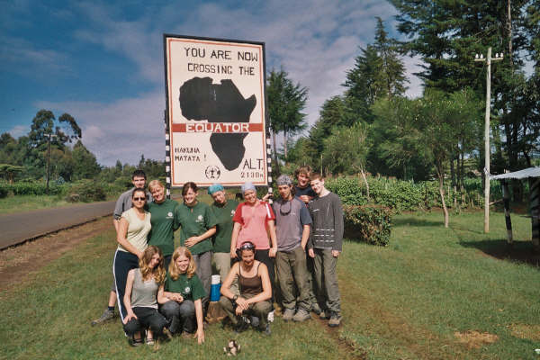
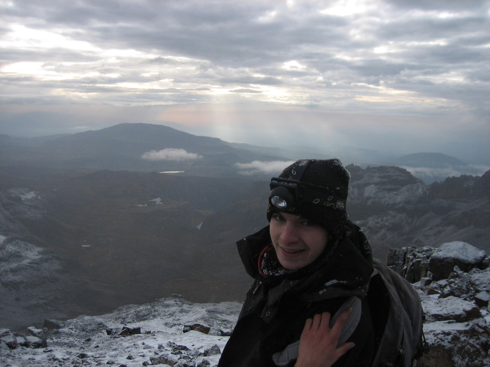
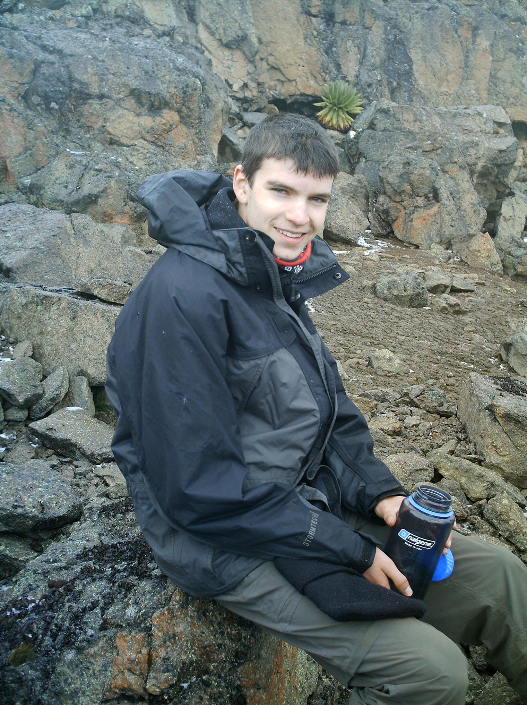
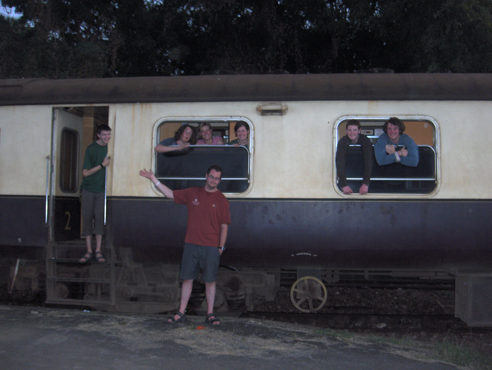

I was cleaning out some photos on my computer today, and I stumbled across some of my photos from my trip to Kenya way back in 2006. I went with World Challenge, an organisation that takes groups of kids (17-18 year olds) to awesome places around the world. I spend a month out there, doing a bit of the tourist stuff like the safaris and seeing a few of the 'Big Five'. We also had a 'challenge week' where we climbed Mt. Kenya, and a week working in an orphanage.

It was a fairly amazing experience, especially as we were in charge for each day - I personally had to organise us moving from Mombasa to Malindi, travelling on a fairly dodgy bus overnight. I think back with some very fond memories of the place...

I just wish I had the rest of these saved on this computer...
