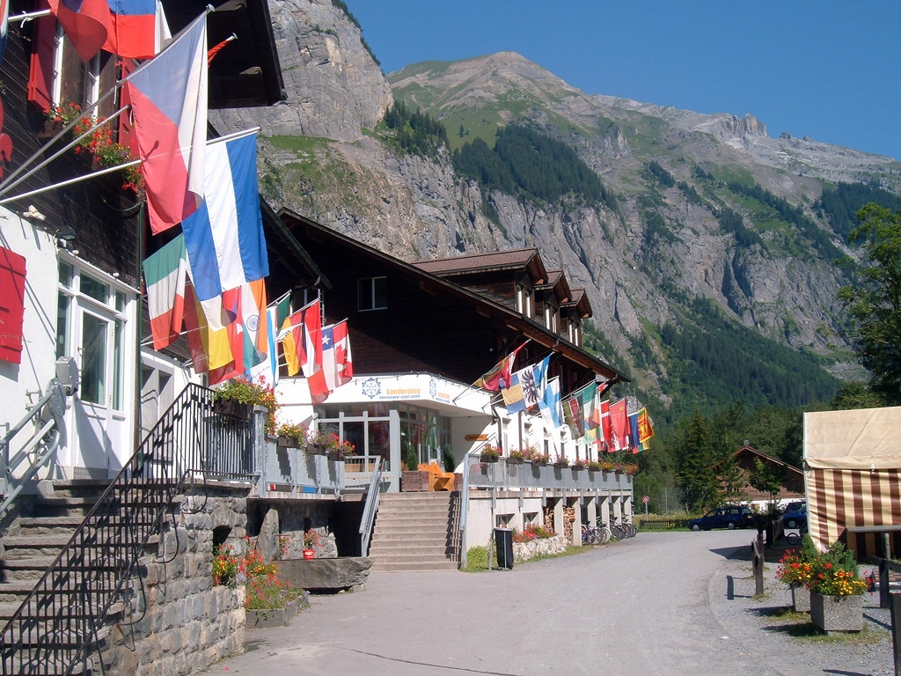

Cross-posted from [kandersteg.posterous.com](http://kandersteg.posterous.com/) where I'll be blogging about my summer in Switzerland from now on:

> So I thought I'd write up where I'm going this summer (only taken me a week):

(via: [Jonty Sewell on Flickr](http://www.flickr.com/photos/jontysewell/3791823876/))

[Kandersteg  International](http://www.kisc.ch/) [Scout Centre](http://en.wikipedia.org/wiki/Kandersteg_International_Scout_Centre) in Switzerland, opened in 1923 by Robert Baden-Powell (who founded the Scouts) as a "Permament  Mini Jamboree" for Scouts all round the world. Over 10 000 guests visit  each year from around 40 different countries. Right in the middle of the  Alps it's a great place for hiking, climbing, mountain biking and quite  a lot more. KISC has a large Chalet which has rooms for 200 people, a large campsite holding 1200 people, and even a sauna! 

I've been there twice before as a Scout with my troop, in 2000 and  2005. I have some pretty awesome memories of doing some great stuff out  there and I'm excited to being going back.

__What I'm doing__

I'm working there for the three Summer season months doing, well, I  don't know! I could be doing anything from cooking breakfast, cleaning  the Chalet, helping out campers in the campsite, working in reception, taking Scouts hiking or rock climbing. So pretty varied then? :-)

__The staff__

The people who I'll be working with come from  all around the world, just like the guests - I've been sent a list of  everybody and I'm sure that I'll meet some pretty cool people.

__The blog__

I'll be keeping this blog updated with my  Kandersteg Adventures - pictures, updates on what I'm doing, maybe even some video and audio... If you want to keep updated just click the  little [Subscribe](http://kandersteg.posterous.com/rss.xml) button on the right hand side or follow me on Twitter: [@40\_thieves](http://twitter.com/40_thieves). Thanks! _(Ed's note: Posterous shut down on 30th April 2013, so this blog was discontinued.)_
