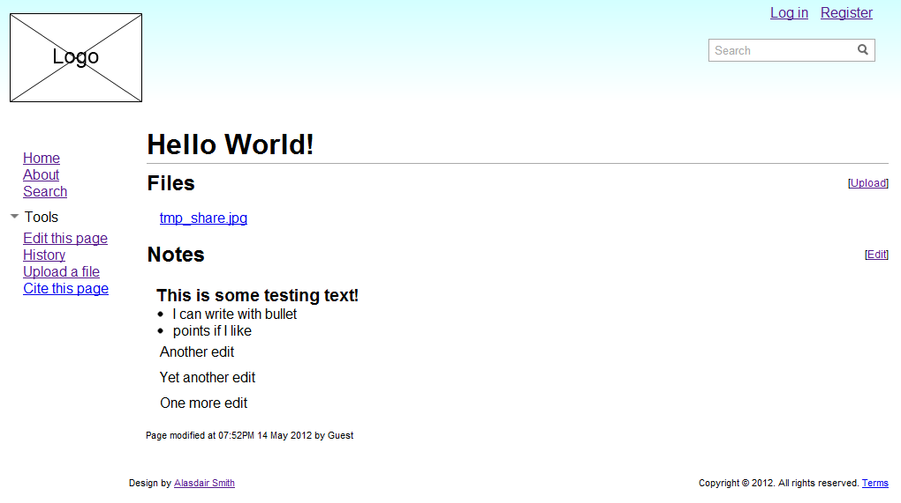

WikiVLE is a Virtual Learning Environment that I built for my Web Client &amp; Server coursework in Winter/Spring 2012

It's a VLE based around the concept of a wiki - all users can work together to create awesome notes about a particular topic that they're learning about. It's kind of a focussed Wikipedia (but nowhere near as good!). Users can upload files such as Powerpoint slides, PDFs and images; edit notes using [Markdown](http://daringfireball.net/projects/markdown/) syntax and log in using the built in account system or via the University of Portsmouth's LDAP server.

I've decided to open source it, mainly because I'm a big proponent of open source and I want to practice what I preach, but also because I wanted you guys to help me out! Hopefully we can work together (using the magic of Git) to make it awesome :)

The [source](https://github.com/40thieves/WikiVLE) is available now on Github, and I'm planning to put up a live demo sometime soon. If you're interested get in touch (see [alasdairsmith.org.uk](http://alasdairsmith.org.uk)) or fork the repo and submit a pull request.
